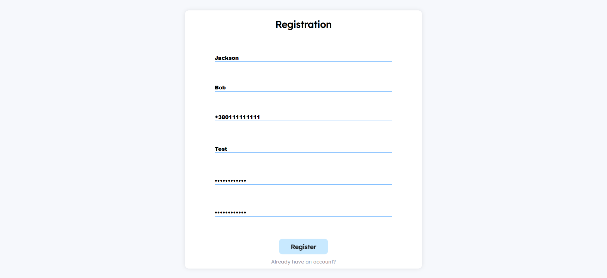
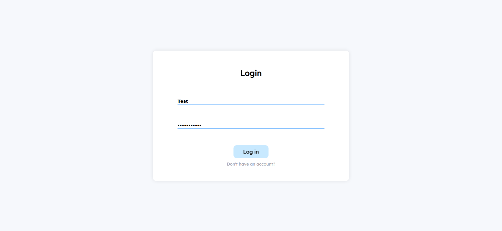
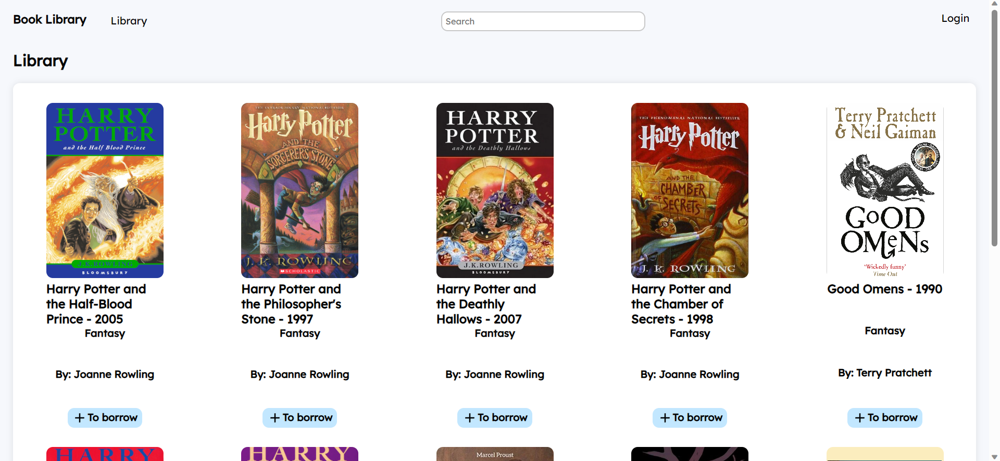
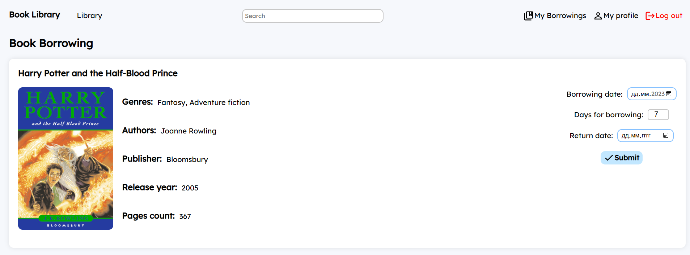
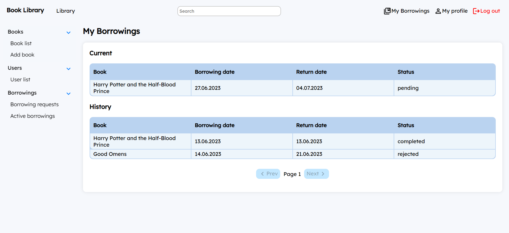
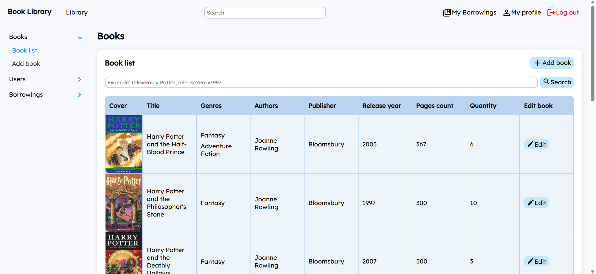
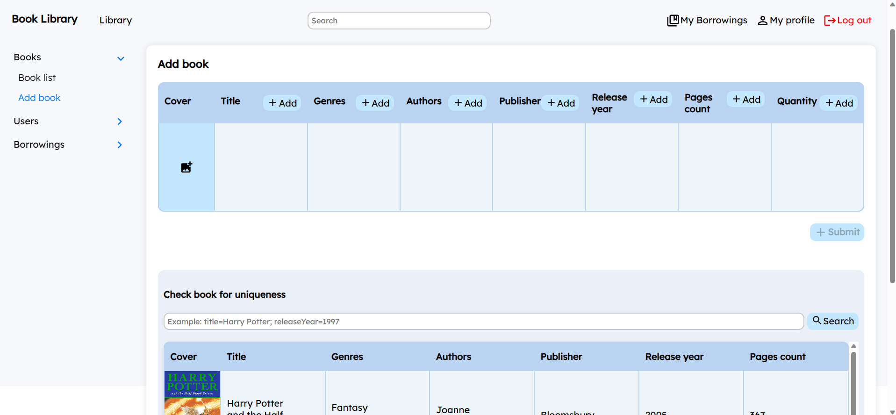
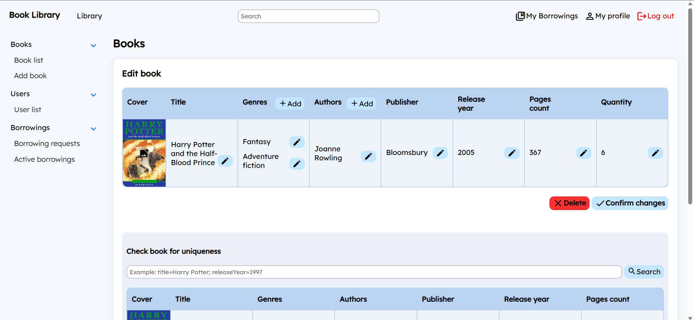
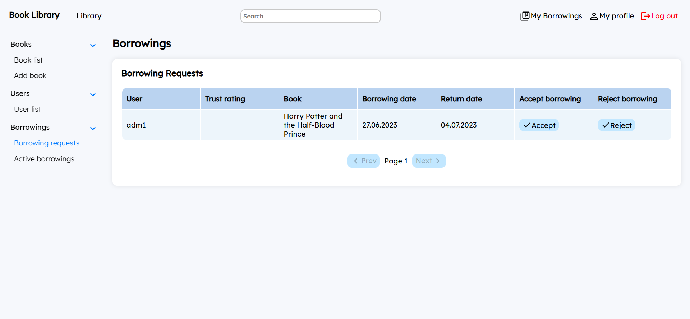

# 📚 Book Library - Loan Service

A comprehensive library loan service designed to manage book borrowing, user roles, and administrative tasks efficiently.

## 🌟 Features

- 👥 **User Roles & Permissions**: Separation of users into **Reader**, **Librarian**, and **Administrator** roles at both UI and database levels
- ⭐ **Reader Trust Rating**: System for tracking and evaluating reader reliability
- 🔐 **Secure Authentication**: Authorization and authentication using Express sessions with password hashing
- 📖 **Book Catalog**: View a paginated list of books
- 📚 **Book Borrowing**: Readers can request and borrow books
- 📊 **Admin & Librarian Dashboard**: Manage book inventory and borrowing requests
- ✏️ **Book Management**: Add and edit books with uniqueness validation (Admin)
- 🔄 **Borrowing & Returning Books**: Administrators and librarians can handle the lending process

## 🛠 Technologies

- ⚙️ **Backend**: Node.js, Express, PostgreSQL, Express-session
- 🎨 **Frontend**: Vite React, Redux Toolkit
- 🗄 **Database**: PostgreSQL

## 🖥 Interface Demo (Main Features)

### 📝 Registration Page

### 🔑 Login Page

### 🏠 Home Page

### 📚 Book Borrowing Page

### 🕘 Reader Borrowing History

### 📊 Administrator & Librarian Dashboard
#### 📖 Book List

#### ➕ Add Book

#### ✏️ Edit Book

#### 📩 Borrowing Requests

🚀 **Efficiently manage your library with Book Library!**
